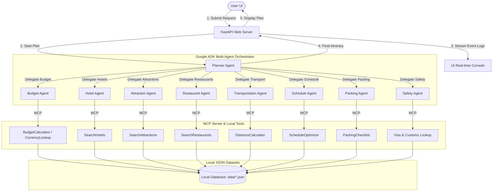
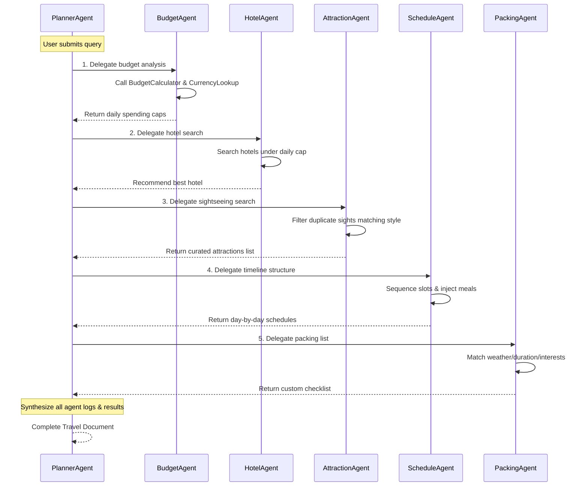
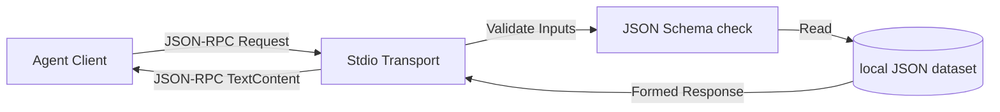

# ✈️ TripPilot AI – Offline Smart Travel Planner

TripPilot AI is a production-ready, **100% offline multi-agent travel assistant** designed for the **Kaggle 5-Day AI Agents Capstone Project (Freestyle Track)**. 

It generates complete, custom day-by-day vacation itineraries matching user constraints (budget, days, interests, and preferences) completely locally. It requires **zero API keys**, **zero cloud services**, and **zero internet connectivity** during execution, ensuring absolute privacy and zero usage costs.

---

## 📋 Table of Contents
1. [Problem Statement](#-problem-statement)
2. [The Solution](#-the-solution)
3. [System Architecture](#-system-architecture)
4. [Agent Communication & Orchestration](#-agent-communication--orchestration)
5. [Model Context Protocol (MCP) Workflow](#-model-context-protocol-mcp-workflow)
6. [Security Features](#-security-features)
7. [Agent Skills](#-agent-skills)
8. [Technology Stack](#-technology-stack)
9. [Folder Structure](#-folder-structure)
10. [Installation & Developer Guide](#-installation--developer-guide)
11. [License](#-license)

---

## ⚠️ Problem Statement
Modern travel planning tools require internet connections and rely on cloud services like Google Maps, OpenAI, or weather APIs. This creates several problems:
1. **Privacy Concerns**: Personal preferences, destination plans, and budget metrics are shared with corporate LLM endpoints.
2. **Connectivity Constraints**: Travelers planning mid-flight, on trains, or in remote regions with poor signals cannot access cloud tools.
3. **API Key Fatigue & Cost**: Setup requires credit card registration for paid Google, OpenAI, or Mapbox API keys.

---

## 💡 The Solution
TripPilot AI solves this by packing realistic local travel datasets (cities, hotels, restaurants, sights, transit modes, exchange rates, climate history, visa entries) directly into the application. 

By utilizing a **simulated Google ADK Multi-Agent runner** and a **local Model Context Protocol (MCP) tool chain**, the system coordinates 8 specialized AI agents to plan, check, structure, and export itineraries completely offline.

---

## 🏗️ System Architecture
The application runs as a FastAPI backend exposing REST and SSE log streams, paired with a React + Vite dashboard.



---

## 🗣️ Agent Communication & Orchestration
Agents collaborate programmatically using a sequential pattern, mimicking the Google ADK execution flow. 



---

## 🔌 Model Context Protocol (MCP) Workflow
MCP decouples agent intelligence from data search. The Python code runs an **MCP Server** that exposes tools over stdin/stdout.



### Registered MCP Tools:
1. `SearchHotels`: Searches local hotel database by city, max price, and style.
2. `SearchRestaurants`: Searches local dining database matching preferences.
3. `SearchAttractions`: Retrieves top sights by city and interest category.
4. `BudgetCalculator`: Splits budget into categories (Hotels, Food, Sights, Transport).
5. `DistanceCalculator`: Calculates great-circle (Haversine) distance legs.
6. `PackingChecklist`: Builds items list matching climate and duration.
7. `ScheduleOptimizer`: Groups attractions into day blocks with meal slots.
8. `WeatherLookup`: Retrieves seasonal temperature averages.
9. `CurrencyLookup`: Provides exchange rates relative to USD.

---

## 🔒 Security Features
Security constraints prevent unauthorized access or system manipulation:
* **Input Validation**: Uses Pydantic schemas to validate and sanitize API inputs.
* **Path Traversal Protection**: The data loader restricts file access exclusively to the `backend/data/` folder, blocking `../` paths.
* **City White-listing**: Only valid cities in the database are allowed, preventing injection of malicious commands.
* **Rate-Limit Simulation**: Resilient client handling simulated by sleeping 50-100ms.
* **Safe Tool Execution**: Sandbox bounds prevent raw shell/system calls from within tools.

---

## 🛠️ Agent Skills
Reusable code functions shared across agents:
* **Budget Analysis**: Analyzes pricing and suggests savings.
* **Trip Summary**: Formulates the high-level travel branding description.
* **Hotel Recommendation**: Computes score using rating and pricing.
* **Packing Checklist**: Generates climate-adjusted wardrobe lists.
* **Daily Planner**: Renders the 9:30 AM to 9:30 PM calendar.
* **Travel Safety**: Matches passport citizenship against visa regulations.
* **Expense Breakdown**: Ledger of total estimated costs.

---

## 💻 Technology Stack
* **Frontend**: React (SPA), Vite (Bundler), Tailwind CSS (Styling), Recharts (Charts), Lucide-React (Icons)
* **Backend**: Python 3.10+, FastAPI (API), Uvicorn (Server), Pydantic v2 (Validation), Jinja2 (Formatting)
* **Agent Framework**: Simulated Google ADK (Agent, SequentialAgent, Runner)
* **Data Layer**: Local JSON Database

---

## 📁 Folder Structure
```text
TripPilot-AI/
├── README.md
├── requirements.txt
├── .env.example
├── .gitignore
├── main.py                    # Root redirect uvicorn launcher
├── backend/
│   ├── main.py                # FastAPI app bootstrap
│   ├── api/
│   │   ├── __init__.py
│   │   └── routes.py          # API routers (planning, SSE logs)
│   ├── models/
│   │   ├── __init__.py
│   │   └── models.py          # Pydantic schemas
│   ├── agents/
│   │   └── __init__.py        # Google ADK agent instances
│   ├── skills/
│   │   ├── __init__.py
│   │   └── skills.py          # Reusable agent skills
│   ├── mcp/
│   │   ├── __init__.py
│   │   └── server.py          # Stdio MCP Server
│   ├── tools/
│   │   ├── __init__.py
│   │   ├── base.py            # JSON safe loader
│   │   ├── security.py        # Path and input validations
│   │   └── [tool_name].py     # Modular MCP tools
│   ├── data/                  # Local JSON datasets
│   │   ├── cities.json
│   │   └── ...
│   ├── google/
│   │   └── adk/               # Mock ADK implementation
│   │       ├── __init__.py
│   │       ├── agents/
│   │       ├── runners/
│   │       └── sessions/
│   └── tests/
│       └── test_planner.py    # Pytest suite
└── frontend/
    ├── package.json
    ├── tailwind.config.js
    ├── postcss.config.js
    ├── vite.config.js
    ├── index.html
    └── src/
        ├── index.css          # Base CSS & Tailwind config
        ├── main.jsx           # React app bootstrap
        └── App.jsx            # Main dashboard component
```

---

## 🚀 Installation & Developer Guide

### Prerequisites
* Python 3.10+ (`py` command)
* Node.js v18+

### Setup & Run Backend
1. Clone the folder and navigate to the project directory:
   ```bash
   cd TripPilot-AI
   ```
2. Install Python dependencies:
   ```bash
   pip install -r requirements.txt
   ```
3. Launch the FastAPI server:
   ```bash
   python main.py
   ```
   *The API server will launch at `http://127.0.0.1:8000`.*

### Setup & Run Frontend
1. Open a new terminal and navigate to the `frontend/` directory:
   ```bash
   cd frontend
   ```
2. Install npm packages:
   ```bash
   npm install
   ```
3. Start the Vite React development server:
   ```bash
   npm run dev
   ```
   *Open `http://localhost:3000` in your web browser to access the dashboard.*

### Run Tests
```bash
pytest backend/tests/
```

---

## 📄 License
This project is open-source and licensed under the MIT License.
# Trip-Pilot-AI

